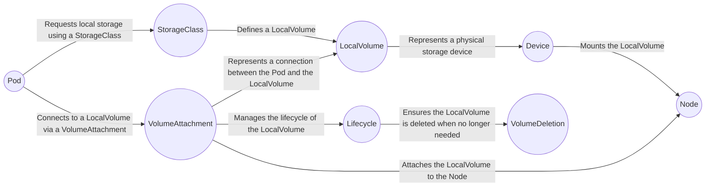
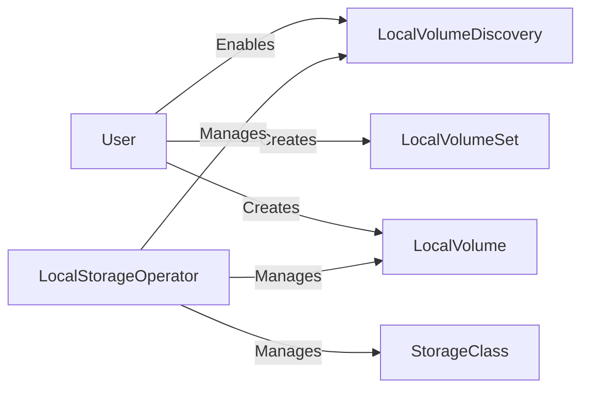

# Local Storage Operator

## The Local Storage Operator (LSO)


The Local Storage Operator (LSO) allows an administrator to configure a storageclass to provision and manage persistent volumes of the local volume type. This greatly simplifies the management of local storage in an Openshift cluster. It provides a declarative approach to managing local storage and automates many of the manual tasks associated with creating and managing local volumes.

The Local Storage Operator allows you to define local storage classes, which represent local storage devices attached to worker nodes in your cluster. These local storage classes can be used to provision local volumes on those nodes. When a Pod requests a local volume using one of these storage classes, the Local Storage Operator ensures that the volume is created and attached to the correct node.

In addition to volume provisioning, the Local Storage Operator also supports features such as volume resizing and volume deletion. It can also automatically handle the rescheduling of Pods if the node hosting the local volume fails.

Overall, the Local Storage Operator simplifies the management of local storage in OpenShift, making it easier to provision and manage local volumes in a declarative and automated way.

[Source](https://docs.openshift.com/container-platform/4.12/storage/persistent_storage/persistent_storage_local/persistent-storage-local.html)

## Installing the Local Storage Operator

There are two ways to install the LSO. Through the GUI and via the CLI. The first step for either path is to configure the `openshift-local-storage` namespace. 

```
$ oc adm new-project openshift-local-storage
```

**GUI:**
To install the Local Storage Operator from the web console, follow these steps:

  1) Log in to the OpenShift Container Platform web console.

  2) Navigate to `Operators` → `OperatorHub`.

  3) Type `Local Storage` into the filter box to locate the Local Storage Operator.

  4) Click `Install`.

  5) On the `Install Operator` page, select `A specific namespace on the cluster`. Select `openshift-local-storage` from the drop-down menu.

  6) Adjust the values for `Update Channel` and `Approval Strategy` to the values that you want.

  7) Click `Install`.

Once finished, the Local Storage Operator will be listed in the Installed Operators section of the web console.

**CLI:**

  1) To install the Local Storage Operator from the CLI, run the following command to get the OpenShift Container Platform major and minor version. It is required for the channel value in the next step.

```
$ OC_VERSION=$(oc version -o yaml | grep openshiftVersion | grep -o '[0-9]*[.][0-9]*' | head -1)
```
  2) Create an object YAML file to define an Operator group and subscription for the Local Storage Operator, such as `openshift-local-storage`.yaml:
    
    Example openshift-local-storage.yaml
```
apiVersion: operators.coreos.com/v1
kind: OperatorGroup
metadata:
  name: local-operator-group
  namespace: openshift-local-storage
spec:
  targetNamespaces:
    - openshift-local-storage
---
apiVersion: operators.coreos.com/v1alpha1
kind: Subscription
metadata:
  name: local-storage-operator
  namespace: openshift-local-storage
spec:
  channel: "${OC_VERSION}"
  installPlanApproval: Automatic 
  name: local-storage-operator
  source: redhat-operators
  sourceNamespace: openshift-marketplace
```
  The user approval policy for an install plan.

  3) Create the Local Storage Operator object by entering the following command:
```
$ oc apply -f openshift-local-storage.yaml
```
  At this point, the Operator Lifecycle Manager (OLM) is now aware of the Local Storage Operator. A ClusterServiceVersion (CSV) for the Operator should appear in the target namespace, and APIs provided by the Operator should be available for creation.

  4) Verify local storage installation by checking that all pods and the Local Storage Operator have been created:

Check that all the required pods have been created:
```
$ oc -n openshift-local-storage get pods
```
Example output
```
NAME                                      READY   STATUS    RESTARTS   AGE
local-storage-operator-746bf599c9-vlt5t   1/1     Running   0          19m
```

Check the ClusterServiceVersion (CSV) YAML manifest to see that the Local Storage Operator is available in the `openshift-local-storage` project:
```
$ oc get csvs -n openshift-local-storage
```
Example output
```
NAME                                         DISPLAY         VERSION               REPLACES   PHASE
local-storage-operator.4.2.26-202003230335   Local Storage   4.2.26-202003230335              Succeeded
```
After all checks have passed, the Local Storage Operator is installed successfully.

[Source](https://docs.openshift.com/container-platform/4.12/storage/persistent_storage/persistent_storage_local/persistent-storage-local.html#local-storage-install_persistent-storage-local)

## Custom resources managed by the LSO


## What is a Local Volume?
In Kubernetes, a `local volume` represents a storage volume that is physically attached to the node where the Pod is scheduled. This means that the data stored in the local volume is only accessible to the Pod running on that specific node, and not to other Pods in the cluster. Local volumes are useful for storing data that is specific to a particular node or Pod, such as node-specific logs or cache data. 

Local volumes are similar to hostPath volumes, but they provide some additional benefits. Specifically, local volumes allow you to decouple the Pod from the underlying node's file system layout, which can help with maintainability and portability.

However, there are also some limitations to using local volumes. For example, if a Pod is rescheduled to a different node, it will lose access to its local volume and any data stored in it. Additionally, local volumes cannot be easily replicated across multiple nodes, which can limit their usefulness for some types of applications.

## How do you define a Local Volume in k8/OCP?
[k8 docs.](https://kubernetes.io/docs/concepts/storage/volumes/#local) 

In k8/OCP, persistent volumes (PVs) can define a `spec.local.path` value to allow access to local storage devices such as disks or partions. 

I.e.
```
apiVersion: v1
kind: PersistentVolume
metadata:
  name: example-pv-filesystem
spec:
  capacity:
    storage: 100Gi
  volumeMode: Filesystem 
  accessModes:
  - ReadWriteOnce
  persistentVolumeReclaimPolicy: Delete
  storageClassName: local-storage 
  local:
    path: /dev/xvdf 
  nodeAffinity:
    required:
      nodeSelectorTerms:
      - matchExpressions:
        - key: kubernetes.io/hostname
          operator: In
          values:
          - example-node
```

[Source](https://docs.openshift.com/container-platform/4.12/storage/persistent_storage/persistent_storage_local/persistent-storage-local.html#create-local-pvc_persistent-storage-local)

**NOTE:** The persistent volumes using local volumes need to specify a `nodeAffinity` as the paths/data referenced in the PV will only exist in a single node. In addition, make sure that the spec.local.path field uses the by-id path, such as /dev/disk/by-id/wwn. This will ensure consistency across reboots. The LSO does not currently support the `LocalVolume` resource `by-path` or `by-partuuid`, such as `/dev/disk/by-path/wwn` or `/dev/disk/by-partuuid`. 

## Using the Local Storage Operator to provision local volumes

In order to use the LSO to provision local volumes, you must meet the following pre-requisites:

  - The Local Storage Operator is installed
  - You have a local disk that meets the following conditions:
    - It is attached to a node.
    - It is not mounted.
    - It does not contain partitions.

If you meet all of these pre-requisites, you can create your `LocalVolume` object that defines how the LSO is going to create the persistent volumes. There are two `spec.storageClassDevices.volumeMode` options, Filesystem and Block. 

To define a LocalVolume with volumeMode `Filesystem`, you can use a `LocalVolume` object like the one below:

```
apiVersion: "local.storage.openshift.io/v1"
kind: "LocalVolume"
metadata:
  name: "local-disks"
  namespace: "openshift-local-storage" 
spec:
  nodeSelector: 
    nodeSelectorTerms:
    - matchExpressions:
        - key: kubernetes.io/hostname
          operator: In
          values:
          - ip-10-0-140-183
          - ip-10-0-158-139
          - ip-10-0-164-33
  storageClassDevices:
    - storageClassName: "local-sc" 
      volumeMode: Filesystem 
      fsType: xfs 
      devicePaths: 
        - /path/to/device 
```

Note that in this example, the nodeselector matches 3 nodes explicitly by hostname and the devices to use by path under `spec.storageClassDevices.devicePaths`. It also sets the `spec.storageClassDevices.volumeMode` to `Filesystem` and `spec.storageClassDevices.fsType` to `xfs`. It is important to ensure that the `spec.storageClassDevices.storageClassName` value is unique for each set of local volumes!

To define a LocalVolume with volumeMode `Block`, you can use a `LocalVolume` object like the one below:

```
apiVersion: "local.storage.openshift.io/v1"
kind: "LocalVolume"
metadata:
  name: "local-disks"
  namespace: "openshift-local-storage" 
spec:
  nodeSelector: 
    nodeSelectorTerms:
    - matchExpressions:
        - key: kubernetes.io/hostname
          operator: In
          values:
          - ip-10-0-136-143
          - ip-10-0-140-255
          - ip-10-0-144-180
  storageClassDevices:
    - storageClassName: "localblock-sc" 
      volumeMode: Block  
      devicePaths: 
        - /path/to/device 
```
Like in the `volumeType: Filesystem` example, the nodeselector matches 3 nodes explicitly by hostname and specifies the devices to use in `spec.storageClassDevices.devicePaths`. When using `volumeMode: block`, the raw block volume is not formatted with a file system. You must ensure that any application running in pods consuming this PV can use raw block devices. 

**NOTE:** The Local Storage Operator does not currently support the `LocalVolume` resource `by-path` or `by-partuuid`, such as `/dev/disk/by-path/wwn` or `/dev/disk/by-partuuid`. Ensure that `by-id` is used.

Once you have your `LocalVolume` object, you can create it using the command below:
```
$ oc create -f <local-volume>.yaml
```

To verify that the provisioner was created and that the corresponding daemon sets were created, you can run the command below:
```
$ oc get all -n openshift-local-storage
```

Example output:
```
NAME                                          READY   STATUS    RESTARTS   AGE
pod/diskmaker-manager-9wzms                   1/1     Running   0          5m43s
pod/diskmaker-manager-jgvjp                   1/1     Running   0          5m43s
pod/diskmaker-manager-tbdsj                   1/1     Running   0          5m43s
pod/local-storage-operator-7db4bd9f79-t6k87   1/1     Running   0          14m

NAME                                     TYPE        CLUSTER-IP      EXTERNAL-IP   PORT(S)             AGE
service/local-storage-operator-metrics   ClusterIP   172.30.135.36   <none>        8383/TCP,8686/TCP   14m

NAME                               DESIRED   CURRENT   READY   UP-TO-DATE   AVAILABLE   NODE SELECTOR   AGE
daemonset.apps/diskmaker-manager   3         3         3       3            3           <none>          5m43s

NAME                                     READY   UP-TO-DATE   AVAILABLE   AGE
deployment.apps/local-storage-operator   1/1     1            1           14m

NAME                                                DESIRED   CURRENT   READY   AGE
replicaset.apps/local-storage-operator-7db4bd9f79   1         1         1       14m
```
Note the desired and current number of daemon set processes. A desired count of 0 indicates that the label selectors were invalid.

And then last but not least, you can list the persistent volumes using the command below:
```
$ oc get pv
```

Example output:
```
NAME                CAPACITY   ACCESS MODES   RECLAIM POLICY   STATUS      CLAIM   STORAGECLASS   REASON   AGE
local-pv-1cec77cf   100Gi      RWO            Delete           Available           local-sc                88m
local-pv-2ef7cd2a   100Gi      RWO            Delete           Available           local-sc                82m
local-pv-3fa1c73    100Gi      RWO            Delete           Available           local-sc                48m
```

NOTE: Once you have created a persistent volume, editing the `LocalVolume` object `fsType` or `volumeMode` values do not trigger any changes on the PV as doing so might result in a destructive operation.

Once you have your PVs, you must create a persistent volume claim (PVC) for the local volume to be accessed by a pod. To create a PVC, you can use the `PersistentVolumeClaim` object below:
```
kind: PersistentVolumeClaim
apiVersion: v1
metadata:
  name: local-pvc-name 
spec:
  accessModes:
  - ReadWriteOnce
  volumeMode: Filesystem 
  resources:
    requests:
      storage: 100Gi 
  storageClassName: local-sc 
```

And once you have your `PersistentVolumeClaim` object, you can create the PVC using the oc create command like below:
```
$ oc create -f <local-pvc>.yaml
```

With the PVC created, you now can reference the PVC in the pod like in the Pod spec below:
```
apiVersion: v1
kind: Pod
spec:
  ...
  containers:
    volumeMounts:
    - name: local-disks 
      mountPath: /data 
  volumes:
  - name: localpvc
    persistentVolumeClaim:
      claimName: local-pvc-name 
```

Sources: 

[1](https://docs.openshift.com/container-platform/4.10/storage/persistent_storage/persistent-storage-local.html#local-volume-cr_persistent-storage-local)
[2](https://docs.openshift.com/container-platform/4.10/storage/persistent_storage/persistent-storage-local.html#create-local-pvc_persistent-storage-local)

## Automating discovery (Tech Preview)

The Local Storage Operator automates local storage discovery and provisioning. With this feature, you can simplify installation when dynamic provisioning is not available during deployment, such as with bare metal, VMware, or AWS store instances with attached devices.

IMPORTANT: Use the LocalVolumeSet object with caution. When you automatically provision persistent volumes (PVs) from local disks, the local PVs might claim all devices that match. If you are using a LocalVolumeSet object, make sure the Local Storage Operator is the only entity managing local devices on the node.

Pre-requisites:
  - You have cluster administrator permissions.
  - You have installed the Local Storage Operator.
  - You have attached local disks to OpenShift Container Platform nodes.
  - You have access to the OpenShift Container Platform web console and the oc command-line interface (CLI).

[Source](https://docs.openshift.com/container-platform/4.12/storage/persistent_storage/persistent_storage_local/persistent-storage-local.html#local-storage-discovery_persistent-storage-local)

When using local volume discovery, a custom resource called `LocalVolumeDisccoveryResults` is created. This object holds the results of the volume discovery so that OCP knows the state of the disks that were discovered. This is the source of truth for the UI elements (i.e. the `Disks` tab under `Compute` → `Nodes`).

Sources:
[1](https://github.com/openshift/local-storage-operator/blob/master/api/v1alpha1/localvolumediscoveryresult_types.go)
[2](https://github.com/openshift/local-storage-operator/tree/master/diskmaker/discovery)


## Enable Automatic Discovery of local devices
To enable automatic discovery of local devices from the web console:

  a) In the Administrator perspective, navigate to `Operators` → `Installed Operators` and click on the `Local Volume Discovery` tab.

  b) Click `Create Local Volume Discovery`.

  c) Select either `All nodes` or `Select nodes`, depending on whether you want to discover available disks on all or specific nodes.

  d) Click `Create`.

A local volume discovery instance named `auto-discover-devices` is displayed.

[Source}(https://docs.openshift.com/container-platform/4.12/storage/persistent_storage/persistent_storage_local/persistent-storage-local.html#local-storage-discovery_persistent-storage-local)

## Display a continuous list of available devices on a node

  a) Log in to the OpenShift Container Platform web console.

  b) Navigate to `Compute` → `Nodes`.

  c) Click the node name that you want to open. The "Node Details" page is displayed.

  d) Select the `Disks` tab to display the list of the selected devices.

  NOTE: The 'Disks' tab will only be available if local volume discovery has been configured.

  The device list updates continuously as local disks are added or removed. You can filter the devices by name, status, type, model, capacity, and mode.
  
[Source}(https://docs.openshift.com/container-platform/4.12/storage/persistent_storage/persistent_storage_local/persistent-storage-local.html#local-storage-discovery_persistent-storage-local)

## How to automatically provision local volumes for the discovered devices from the web console

  a) Navigate to `Operators` → `Installed Operators` and select `Local Storage` from the list of Operators.

  b) Select `Local Volume Set` → `Create Local Volume Set`.

  c) Enter a volume set name and a storage class name.

  d) Choose `All nodes` or `Select nodes` to apply filters accordingly.
    
    NOTE: Only worker nodes are available, regardless of whether you filter using All nodes or Select nodes.

  e) Select the disk type, mode, size, and limit you want to apply to the local volume set, and click Create.

  A message displays after several minutes, indicating that the "Operator reconciled successfully."
  
[Source}(https://docs.openshift.com/container-platform/4.12/storage/persistent_storage/persistent_storage_local/persistent-storage-local.html#local-storage-discovery_persistent-storage-local)

## How to provision local volumes for the discovered devices from the CLI

  a) Create an object YAML file to define the local volume set, such as `local-volume-set.yaml`, as shown in the following example:
```
apiVersion: local.storage.openshift.io/v1alpha1
kind: LocalVolumeSet
metadata:
  name: example-autodetect
spec:
  nodeSelector:
    nodeSelectorTerms:
      - matchExpressions:
          - key: kubernetes.io/hostname
            operator: In
            values:
              - worker-0
              - worker-1
  storageClassName: example-storageclass 
  volumeMode: Filesystem
  fstype: ext4
  maxDeviceCount: 10
  deviceInclusionSpec:
    deviceTypes: 
      - disk
      - part
    deviceMechanicalProperties:
      - NonRotational
    minSize: 10G
    maxSize: 100G
    models:
      - SAMSUNG
      - Crucial_CT525MX3
    vendors:
      - ATA
      - ST2000LM
```

  b) Create the local volume set object:
```
$ oc apply -f local-volume-set.yaml
```

  c) Verify that the local persistent volumes were provisioned based on the storage class:
```
$ oc get pv
```

Example output:
```
NAME                CAPACITY   ACCESS MODES   RECLAIM POLICY   STATUS      CLAIM   STORAGECLASS           REASON   AGE
local-pv-1cec77cf   100Gi      RWO            Delete           Available           example-storageclass    In case others hit that, when you press the 'Save for Later' button, it brings you to the 'Revise Goals' page. That is where the goals 'disappeared'. If you go back to 'My Individual Goals' all 4 will show up again.         88m
local-pv-2ef7cd2a   100Gi      RWO            Delete           Available           example-storageclass            82m
local-pv-3fa1c73    100Gi      RWO            Delete           Available           example-storageclass            48m
```

NOTE: Results are deleted after they are removed from the node. Symlinks must be manually removed.

[Source}(https://docs.openshift.com/container-platform/4.12/storage/persistent_storage/persistent_storage_local/persistent-storage-local.html#local-storage-discovery_persistent-storage-local)

## Using tolerations with Local Storage Operator pods

As an OCP administrator, you will run across use-cases where you want to ensure that specific nodes are available for a specific subset of workloads. Typically, taints and tolerations are the cleanest way to achieve this goal. In order to allow LSO to use tainted nodes, you must add tolerations to the `Pod` or `DaemonSet` definitions. 

You apply tolerations to the Local Storage Operator pod through the LocalVolume resource and apply taints to a node through the node specification. A taint on a node instructs the node to prevent scheduling of all pods that do not tolerate the taint. Using a specific taint that is not on other pods ensures that the Local Storage Operator pod can also run on that node.


Prerequisites

  - The Local Storage Operator is installed.

  - Local disks are attached to OpenShift Container Platform nodes with a taint.

  - Tainted nodes are expected to provision local storage.

Example:

Modify the YAML file that defines the Pod and add the LocalVolume spec, as shown in the following example:
```
apiVersion: "local.storage.openshift.io/v1"
kind: "LocalVolume"
metadata:
  name: "local-disks"
  namespace: "openshift-local-storage"
spec:
  tolerations:
    - key: localstorage 
      operator: Equal 
      value: "localstorage" 
  storageClassDevices:
      - storageClassName: "localblock-sc"
        volumeMode: Block 
        devicePaths: 
          - /dev/xvdg
```

(Optional) To create local persistent volumes on only tainted nodes, modify the YAML file and add the LocalVolume spec, as shown in the following example:
```
spec:
  tolerations:
    - key: node-role.kubernetes.io/master
      operator: Exists
```

The defined tolerations will be passed to the resulting daemon sets, allowing the diskmaker and provisioner pods to be created for nodes that contain the specified taints.

[Source](https://docs.openshift.com/container-platform/4.12/storage/persistent_storage/persistent_storage_local/persistent-storage-local.html#local-tolerations_persistent-storage-local)

## Expanding Local Volumes

In OCP 4.10+, it is possible to set `AllowVolumeExpansion` in the storageclass object for local volumes and manually expand persistent volumes (PVs) and persistent volume claims (PVCs) created by using the local storage operator (LSO).


With the commit [here](https://github.com/openshift/local-storage-operator/commit/fecd35b92aaa3281f8695ad14257f0ee25fcac79#diff-60c165f7bf5f76ef98ba5a1d03c544c3fad40ab4178c0dbe73774b8c27841501), it became possible to follow the procedure described in the offical RH docs below to expand a PV/PVC. Note that the commit was in the 4.8 branch, but the support for local-volume expansion (and documenation) started with 4.10+. 

Expanding persistent volumes:https://docs.openshift.com/container-platform/4.10/storage/expanding-persistent-volumes.html

Steps for expanding local-volume type persistent volumes:

  1) Expand the underlying devices, and ensure that appropriate capacity is available on theses devices.

  2) Update the corresponding PV objects to match the new device sizes by editing the `.spec.capacity` field of the PV.

  3) For the storage class that is used for binding the PVC to PV, set `allowVolumeExpansion: true`.

```
apiVersion: storage.k8s.io/v1
kind: StorageClass
...
parameters:
  type: local-volume
allowVolumeExpansion: true 
```

  4) For the PVC, set `.spec.resources.requests.storage` to match the new size.

The kubelet should automatically expand the underlying file system on the volume, if necessary, and update the status field of the PVC to reflect the new size.

[Source](https://docs.openshift.com/container-platform/4.12/storage/expanding-persistent-volumes.html#expanding-local-volumes_expanding-persistent-volumes)

## Local Storage Operator Metrics

OCP provides the following metrics for the LSO to the monitoring stack:

  - `lso_discovery_disk_count`: total number of discovered devices on each node

  - `lso_lvset_provisioned_PV_count`: total number of PVs created by LocalVolumeSet objects

  - `lso_lvset_unmatched_disk_count`: total number of disks that Local Storage Operator did not select for provisioning because of mismatching criteria

  - `lso_lvset_orphaned_symlink_count`: number of devices with PVs that no longer match LocalVolumeSet object criteria

  - `lso_lv_orphaned_symlink_count`: number of devices with PVs that no longer match LocalVolume object criteria

  - `lso_lv_provisioned_PV_count`: total number of provisioned PVs for LocalVolume

To use these metrics, be sure to:

  - Enable support for monitoring when installing the Local Storage Operator.

  - When upgrading to OpenShift Container Platform 4.9 or later, enable metric support manually by adding the `operator-metering=true` label to the namespace.

[Source](https://docs.openshift.com/container-platform/4.12/storage/persistent_storage/persistent_storage_local/persistent-storage-local.html#local-storage-metrics_persistent-storage-local)

## Using local storage for Openshift Virtualization guests

When using storage provisioned by the LSO to back Openshift Virtualization guests, sometimes you will need/want to move these guests from node to node. In order to achieve this, you must clone the guests disk to a new local volume on the destination node. This process uses a `DataVolume` manifest specifying the source PVC `spec.volumes.persistentVolumeClaim.claimName` and the destination PV using a label. 

[Source](https://docs.openshift.com/container-platform/4.12/virt/virtual_machines/virtual_disks/virt-moving-local-vm-disk-to-different-node.html)

## How do I remove or delete a local volume or local volume set?

Occasionally, local volumes and local volume sets must be deleted. While removing the entry in the resource and deleting the persistent volume is typically enough, if you want to reuse the same device path or have it managed by a different storage class, then additional steps are needed.

NOTE: The following procedure outlines an example for removing a local volume. The same procedure can also be used to remove symlinks for a local volume set custom resource.

Pre-requisites:
  - The persistent volume must be in a Released or Available state. Deleting a persistent volume that is still in use can result in data loss or corruption!

Example:
1) Edit the previously created local volume to remove any unwanted disks.
  a) Edit the cluster resource:
  ```
  $ oc edit localvolume <name> -n openshift-local-storage
  ```

  b) Navigate to the lines under devicePaths, and delete any representing unwanted disks.

2) Delete any persistent volumes created.
```
$ oc delete pv <pv-name>
```

3) Delete any symlinks on the node.
  a) Create a debug pod on the node:
  ```
  $ oc debug node/<node-name>
  ```

  b) Change your root directory to the host:
  ```
  $ chroot /host
  ```

  c) Navigate to the directory containing the local volume symlinks.
  ```
  $ cd /mnt/openshift-local-storage/<sc-name> 
  ```

  d) Delete the symlink belonging to the removed device.
  ```
  $ rm <symlink>
  ```

[Source](https://docs.openshift.com/container-platform/4.12/storage/persistent_storage/persistent_storage_local/persistent-storage-local.html#local-removing-device_persistent-storage-local)

## Uninstalling the Local Storage Operator

To uninstall the Local Storage Operator, you must remove the Operator and all created resources in the openshift-local-storage project. 

Uninstalling the Local Storage Operator while local storage PVs are still in use is not recommended. While the PVs will remain after the Operator’s removal, there might be indeterminate behavior if the Operator is uninstalled and reinstalled without removing the PVs and local storage resources.

Procedure:
1) Delete any local volume resources installed in the project, such as localvolume, localvolumeset, and localvolumediscovery:
```
$ oc delete localvolume --all --all-namespaces
$ oc delete localvolumeset --all --all-namespaces
$ oc delete localvolumediscovery --all --all-namespaces
```

2) Uninstall the Local Storage Operator from the web console.
  a) Log in to the OpenShift Container Platform web console.
  b) Navigate to `Operators` → `Installed Operators`.
  c) Type `Local Storage` into the filter box to locate the Local Storage Operator.
  d) Click the Options menu 'kebab' at the end of the `Local Storage Operator`.
  e) Click `Uninstall Operator`.
  f) Click `Remove` in the window that appears.

3) The PVs created by the Local Storage Operator will remain in the cluster until deleted. After these volumes are no longer in use, delete them by running the following command:
```
$ oc delete pv <pv-name>
```

4) Delete the `openshift-local-storage` project:
```
$ oc delete project openshift-local-storage
```

[Source](https://docs.openshift.com/container-platform/4.12/storage/persistent_storage/persistent_storage_local/persistent-storage-local.html#local-storage-uninstall_persistent-storage-local)

## local-storage-operator Github

The upstream local storage operator github can be found [here](https://github.com/openshift/local-storage-operator).
